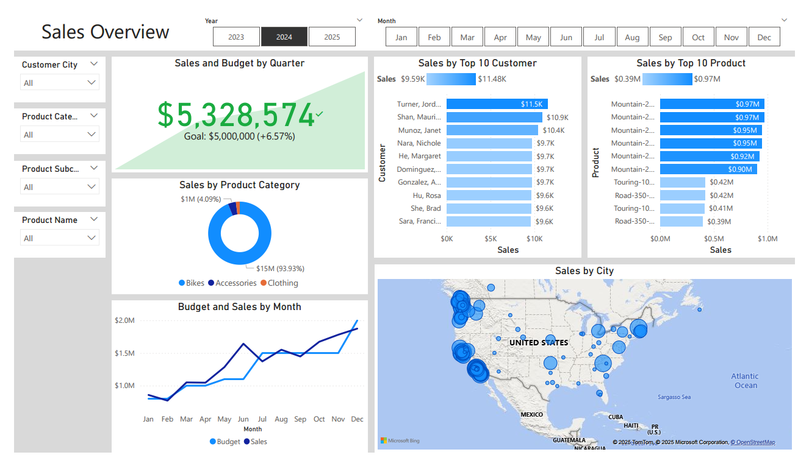
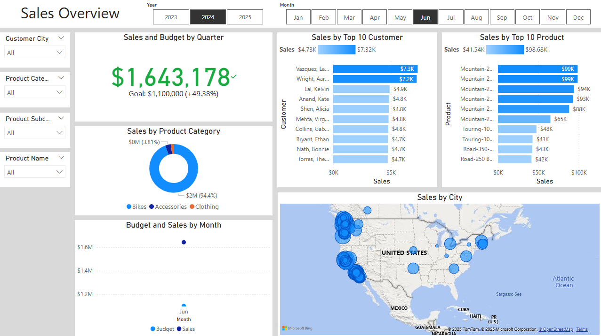
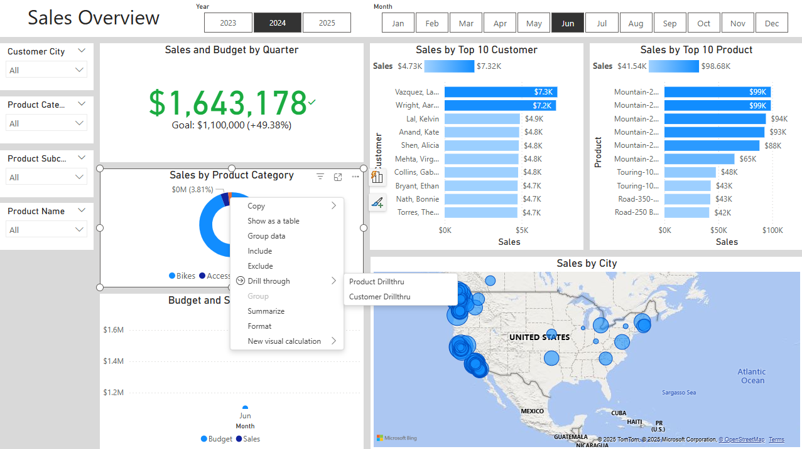
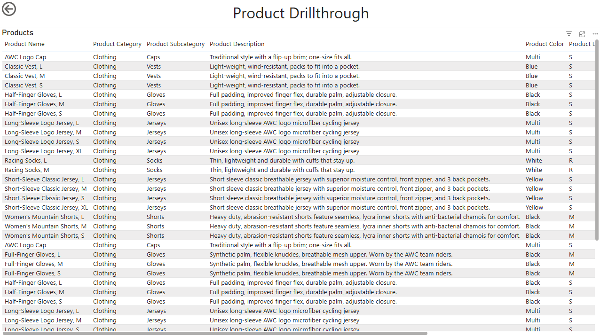

# AdventureWorks Sales Data

## Overview
This is a report built following [Ali Ahmad's Data Analyst Porfolio Project](https://www.youtube.com/playlist?list=PLMfXakCUhXsEUtk8c0zWr4whamGxLhAu0).

Although I followed the series to build the report, I added my own extra touches to the report:
- Due to not having access to the Dynamic KPI Card visual, I used the regular KPI visual instead. 
- I built my own calendar in DAX (to showcase my DAX skills).
- I added two drillthrough dashboards for customers and products called Customer Drillthru and Product Drillthru.

## Task
Analyze Internet Sales from the AdventureWorks sample database using a provided (fake) budget.

## Data Used
**Note:** Some of the data comes from an updated version of the [AdventureWorks database](https://learn.microsoft.com/en-us/sql/samples/adventureworks-install-configure?view=sql-server-ver17&tabs=ssms).

All SQL files can be found under the [SQL Queries](https://github.com/kgosse412/adventureworks_sales_data/tree/main/SQL%20Queries) directory and all data files can be found under the [Data](https://github.com/kgosse412/adventureworks_sales_data/tree/main/Data) folder.

| Data File Name | Description |
|----------------|-------------|
| dim_customer.csv | Customer data, including customer name, email, and city, from the customer dimension table called DimCustomer from the Adventureworks database. |
| dim_product.csv | Product data, including name, category, color, etc., from the product dimension table called DimProduct from the Adventureworks database. |
| fact_internetsales.csv | Internet sales data, including date keys and order numbers from the internet sales table called FactInternetSales from the Adventureworks database. |
| SalesBudget_updated.xlsx | Provided sales budget data by month from 2023 to now. |

## Tools Used
- SQL Server 2022
- SQL Server Management Studio 21.1.3
- Power BI (April 2025)

## Dashboard Images
The full dashboard can be seen in PDF form by clicking on [adventureworks_sales_report.pdf](https://github.com/kgosse412/adventureworks_sales_data/blob/main/adventureworks_sales_report.pdf).

Sales Overview Tab (w/o Month slicer selected)

Sales Overview Tab (w/ Month slicer selected)

Drillthrough Functionality

